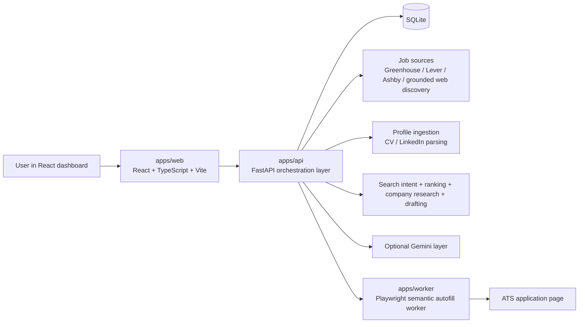

# PT x Job Hunting Agent

Local-first job search workspace for turning a CV, a ranked shortlist, and ATS application forms into reviewable drafts and guarded browser automation.

The product is intentionally human-in-the-loop. It helps with profile parsing, lead discovery, ranking, drafting, semantic autofill, and final submission, while keeping auditability, screenshots, logs, and a clear approval boundary.

## Current Product Surface

- Parse a CV from `PDF`, `DOCX`, or plain text into a structured profile.
- Merge additional context from pasted LinkedIn text or exported LinkedIn HTML.
- Seed editable job-search intent from the merged profile so discovery and ranking share the same target titles, responsibilities, locations, and keywords.
- Discover roles manually from Greenhouse, Lever, and Ashby by company identifier, or use experimental Gemini-grounded web discovery for direct ATS job pages.
- Rank jobs using title alignment, skills, location, intent alignment, and seniority/scope signals.
- Generate tailored application drafts with summaries, cover notes, and screening answers.
- Improve long-form answers and cover notes with an optional Gemini layer.
- Run a semantic Playwright worker that extracts fields from ATS pages, classifies them, resolves answers, and pauses when review is needed.
- Persist every worker run with fields, actions, logs, screenshots, and status.
- Confirm ATS submission separately from just clicking submit.
- Track already-handled roles in the shortlist to reduce duplicate applications.
- Keep the UI manageable with filters, collapse controls, delete flows, and lightweight toast notifications.

## Architecture Overview



## Runtime Components

### `apps/web`

- React 19 + TypeScript + Vite dashboard.
- Covers profile intake, manual ATS discovery, experimental AI web discovery, shortlist review, draft editing, AI assist, worker preview, run review, screenshots, and deletion flows.
- Uses typed API helpers from `apps/web/src/api.ts`.
- Keeps applied roles visible but de-emphasized to avoid duplicate work.

### `apps/api`

- FastAPI orchestration layer.
- Owns persistence, ranking, research, drafting, worker execution, and dashboard aggregation.
- Uses SQLAlchemy models with a local SQLite database.
- Applies lightweight runtime schema updates on startup for the local database.

### `apps/worker`

- Python + Playwright worker for ATS interaction.
- Extracts native form controls and custom ARIA widgets such as comboboxes, radio groups, and checkbox groups.
- Classifies fields semantically into canonical concepts such as `email`, `phone_country_code`, `work_authorization`, `cover_note`, or `custom_question`.
- Resolves answers from profile data, draft content, existing screening answers, user overrides, or Gemini.
- Blocks final submit when required actions fail or required review items still exist.
- Detects post-submit confirmation instead of assuming a click means success.

### Local Data And Artifacts

- `data/app.db`: local SQLite state
- `data/uploads/`: latest uploaded resume and related artifacts
- `artifacts/screenshots/`: preview and submit run screenshots

## Repository Layout

```text
job_hunter_agent/
├── apps/
│   ├── api/        FastAPI app, models, routers, services
│   ├── web/        React dashboard
│   └── worker/     Playwright-based semantic autofill worker
├── artifacts/      Worker screenshots and generated artifacts
├── data/           Local SQLite database and uploads
├── scripts/
│   └── dev.py      Starts API and web dev servers together
├── tests/          Worker, API, ranking, drafting, deletion, research tests
├── pyproject.toml  Python dependencies and test/lint config
└── README.md
```

## End-To-End Workflow

1. Upload a CV and optionally merge LinkedIn content into one candidate profile.
2. Review or edit the seeded search intent for titles, responsibilities, locations, workplace modes, and keywords.
3. Discover roles either through manual ATS discovery (`Greenhouse`, `Lever`, `Ashby`) or experimental AI web discovery constrained to direct ATS job pages.
4. Rank jobs against the profile and search intent, then review them in the shortlist.
5. Create a draft for a role or reopen an existing one from the shortlist.
6. Edit cover notes and screening answers manually or with AI assist.
7. Run `Preview Autofill` to inspect extracted fields, unresolved questions, selector choices, and planned actions.
8. Approve or override hard questions.
9. Run final submit only when the worker has enough confidence to proceed.
10. Review the resulting worker run, logs, screenshot, and confirmation state.

## Semantic Worker Pipeline

The worker is the main differentiator. It is not a static selector script.

1. `extract_form_fields(page)`
   - Reads the live DOM.
   - Captures labels, question text, widget shape, options, and selector candidates.
   - Opens some dynamic combobox widgets to harvest options before classification.

2. `classify_fields(...)`
   - Uses heuristics first.
   - Uses Gemini only for ambiguous fields when configured.

3. `resolve_fields(...)`
   - Prefers explicit user overrides.
   - Falls back to profile data, existing draft answers, or AI drafting when appropriate.
   - Keeps structured choice fields as structured review items instead of flattening them into free text.

4. `_build_actions(...)`
   - Converts resolved fields into concrete Playwright actions.
   - Uses ordered selector candidates before generic platform fallback selectors.

5. `_apply_actions(...)`
   - Executes fills, selects, clicks, file uploads, and custom widget interaction.
   - Stops short of submit if a required field action cannot be applied.

6. `_confirm_submission(...)`
   - Checks for success signals after submit.
   - Looks for confirmation text, confirmation-style redirects, or explicit submitted markers.
   - Separates `submit_clicked` from true ATS-confirmed `submitted`.

## Submission Status Semantics

These statuses now matter operationally:

| Status | Meaning |
| --- | --- |
| `preview_ready` | Preview generated, no fields submitted |
| `awaiting_answers` | Required fields still need review |
| `ready_for_submit` | Fields prepared but final submit not completed |
| `submit_clicked` | Submit was clicked, but ATS confirmation was not detected |
| `submitted` | ATS confirmation signal was detected after submit |
| `failed` | Browser automation failed or timed out |

In the UI, `Application sent` maps only to `submitted`, not to a raw submit click.

## Dashboard Behavior

The dashboard has evolved beyond a simple form runner.

- `Ranked Jobs` can fully collapse to reduce scroll depth.
- Applied roles are hidden by default behind `Show applied`.
- Applied roles render greyed out when shown.
- Roles with an existing draft show `Open draft` instead of creating a duplicate draft.
- Worker runs surface logs, screenshots, review items, and confirmation-aware status.
- Toast notifications surface warnings and failures without relying only on the status panel.
- Delete flows exist for profile sources, job leads, drafts, and worker runs.

## Main Domain Models

### `CandidateProfile`

Merged profile used for ranking, drafting, and worker resolution.

### `ProfileSource`

Individual inputs such as CV upload or LinkedIn import. These can be deleted independently.

### `JobLead`

Discovered opportunity from manual ATS sourcing, AI grounded web discovery, or direct capture flows. Stores source metadata, discovery provenance, ranking output, research context, and can reflect the most recently recorded application state in the workspace.

### `ApplicationDraft`

Editable application package for a specific job lead. Stores tailored summary, cover note, screening answers, and the latest draft status.

### `WorkerRun`

Immutable snapshot of one preview or submission attempt. Stores extracted fields, review items, actions, logs, screenshots, and status.

## Safety Model

- Local-first by default: state is stored in the local SQLite database.
- Worker runs default to preview/dry-run unless submit is explicitly requested.
- Final submission still requires an explicit submit action from the dashboard.
- If a field cannot be applied reliably, the worker stops before final submit.
- LinkedIn is used for profile enrichment; job discovery is centered on ATS-hosted apply flows and reviewable AI search results.
- Delete operations exist across the workspace so data stays manageable.
- Submission confirmation is evidence-based, not click-based.

## Optional AI Layer

Gemini is optional, not required.

When configured, it is used for:

- grounded web discovery of direct ATS job pages
- ambiguous field classification
- long-form answer drafting
- cover note improvement
- screening answer improvement

When disabled or unavailable, the system falls back to deterministic behavior where possible, and manual ATS discovery remains available even if AI discovery is degraded.

## Quick Start

1. Create local configuration:

```bash
cp .env.example .env
```

2. Install Python dependencies:

```bash
uv sync
```

3. Install frontend dependencies:

```bash
cd apps/web && npm install
```

4. Install the Playwright browser:

```bash
uv run playwright install chromium
```

5. Start the API and web app together from the repo root:

```bash
uv run python scripts/dev.py
```

6. Open `http://localhost:5173`.

## Environment Variables

Key values from `.env.example`:

- `JOB_AGENT_API_HOST`: FastAPI bind host
- `JOB_AGENT_API_PORT`: FastAPI bind port
- `JOB_AGENT_WEB_ORIGIN`: allowed web origin for CORS
- `JOB_AGENT_DATABASE_URL`: SQLite connection string
- `JOB_AGENT_DEFAULT_DRY_RUN`: default worker safety mode
- `JOB_AGENT_GITHUB_TOKEN`: optional GitHub token for company research
- `JOB_AGENT_GEMINI_API_KEY`: optional Gemini API key
- `JOB_AGENT_GEMINI_MODEL`: Gemini model name
- `JOB_AGENT_GEMINI_TIMEOUT_SECONDS`: Gemini request timeout
- `JOB_AGENT_GEMINI_DISCOVERY_MODEL`: Gemini model dedicated to AI web discovery
- `JOB_AGENT_GEMINI_DISCOVERY_TIMEOUT_SECONDS`: timeout for grounded web discovery calls
- `JOB_AGENT_GEMINI_DISCOVERY_MAX_ATTEMPTS`: retry count for flaky grounded discovery responses
- `VITE_API_BASE_URL`: optional explicit frontend API base URL. Leave blank in local dev to use the Vite `/api` proxy.

## Key API Surfaces

### Meta

- `GET /api/health`
- `GET /api/dashboard`

### Profile

- `GET /api/profile`
- `GET /api/profile/sources`
- `POST /api/profile/cv`
- `POST /api/profile/linkedin`
- `PUT /api/profile`
- `DELETE /api/profile/sources/{source_id}`

### Jobs

- `GET /api/jobs`
- `POST /api/jobs/discover/greenhouse`
- `POST /api/jobs/discover/lever`
- `POST /api/jobs/discover/ashby`
- `POST /api/jobs/discover/web`
- `POST /api/jobs/discover/linkedin`
- `POST /api/jobs/{job_id}/research`
- `POST /api/jobs/{job_id}/draft`
- `POST /api/jobs/bulk-delete`
- `DELETE /api/jobs/{job_id}`

### Applications And Worker Runs

- `GET /api/applications`
- `GET /api/applications/runs`
- `GET /api/applications/runs/{run_id}/screenshot`
- `POST /api/applications/{application_id}/assist`
- `POST /api/applications/{application_id}/run`
- `DELETE /api/applications/{application_id}`
- `DELETE /api/applications/runs/{run_id}`

## Development Commands

Run backend tests:

```bash
uv run pytest
```

Run Ruff checks:

```bash
uv run ruff check .
```

Format Python:

```bash
uv run ruff format .
```

Build the frontend:

```bash
cd apps/web && npm run build
```

Lint the frontend:

```bash
cd apps/web && npm run lint
```

## Current Scope And Limits

- Best-covered ATS platforms today are Greenhouse, Lever, and Ashby.
- AI web discovery is intentionally constrained to direct ATS job pages and can still degrade when Gemini grounded search is slow or returns poor structure.
- The worker handles both native inputs and many custom ARIA-style widgets, but highly bespoke async widgets and multi-step application flows can still require manual review.
- Submission confirmation currently relies on detectable success signals on the resulting page; some ATS variants may still fall back to `submit_clicked` even if the submission likely worked.
- The product is optimized to reduce repetitive application effort, not to invisibly spray applications without inspection.
- The workspace is currently local-first and single-user rather than multi-tenant.
